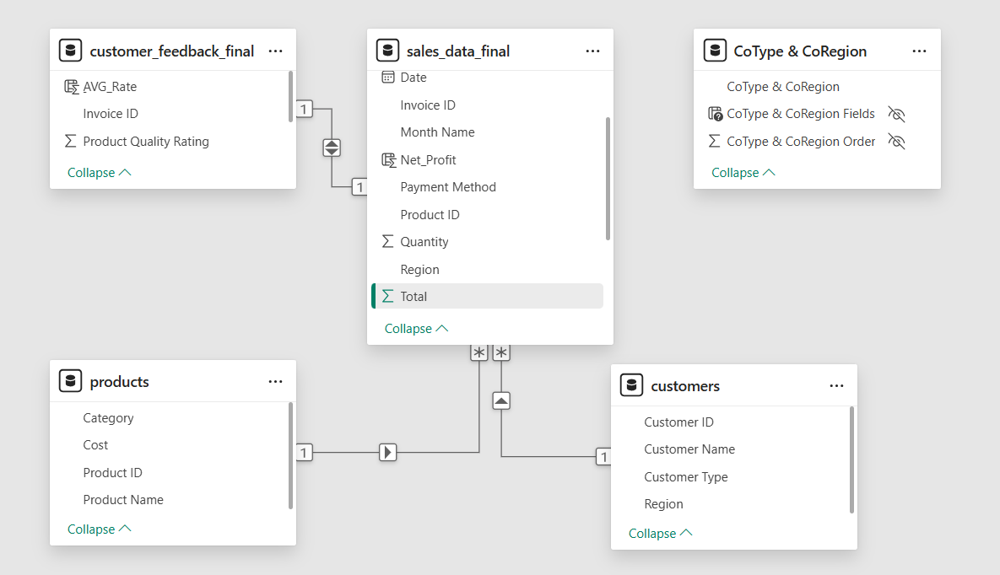
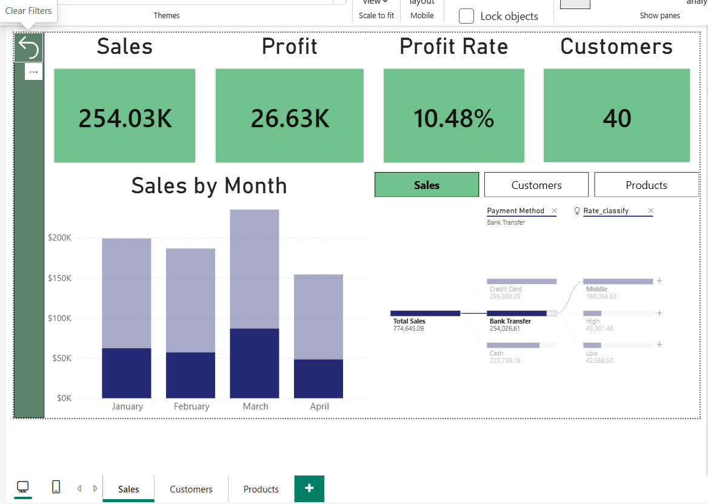

# 📊  customer behavior and sales performance Analysis Dashboard
## 📌 Business Problem
The company lacks a clear vision of its sales performance across regions, product categories, and customer types. 
There is no clear understanding of which products generate the most profit or which customer segments are most valuable.

## 📊 Project Overview
This project analyzes sales data from Jan 2024 to Apr 2024 using Power BI to provide insights into sales performance, customer behavior, and products .

## 🎯 Objectives 
- Identify top-selling products.
- Customer satisfaction by region, product type, and customer type.
- Factors affecting high ratings.
- Analysis of factors affecting revenues.

## 🛠️ Tools Used
- Microsoft Power BI
- DAX
- Data Modeling
- CSV Files

## 📂 Dataset
The dataset includes:
- sales data final Data 
- customer feedback final Data
- Products Data
- customers Data

## 🧩 Data Model
The data model follows a star schema with a central sales fact table connected to dimension tables such as customers, products, and customer feedback.

## 📊 Dashboard Features
- KPI Cards (Total Profit, Total Sales )
- Sales by Regoin
- Product Category Distribution
- Time-based Rating
- Tree show distribution sales by customers 

## 🖼️ Dashboard Preview

## 🧠 Key Insights
- Increase Sales in the month of March.
- Sharp drop in rating.
- Decrease in sales of all products in the central region.

## ▶️ How to Use
1. Download the .pbix file
2. Open it in Power BI Desktop
3. Use filters and slicers to explore the data

## 📁 Project Structure
Analyze_customer_behavior&sales_performance
│
├── data
├── dashboard
├── images
└── README.md

## 🚀 Future Improvements
- Add more KPIs.
- Distribution of evaluation based on region.
- Net profit of products.

👤 Author

Data Analyst Project by Uosef Eissa
